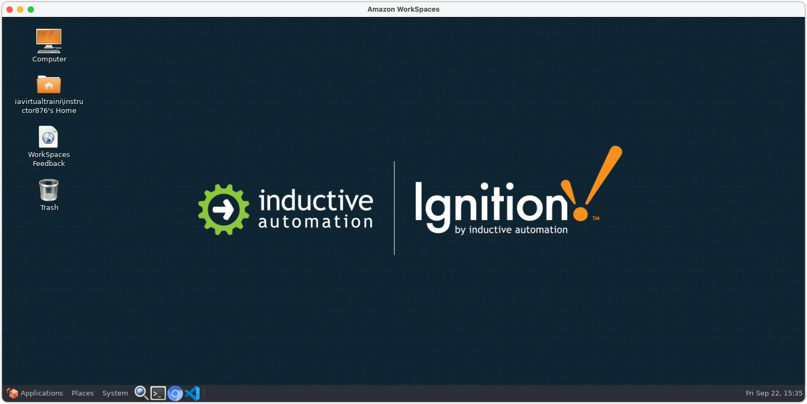

# Preparation

You'll need to have your Amazon WorkSpaces session launched, which provides the following:

- Linux Desktop with VSCode
- Docker Engine and Docker CLI tools, including Compose V2 plugin

If you've got something like the above, you're ready to begin!
