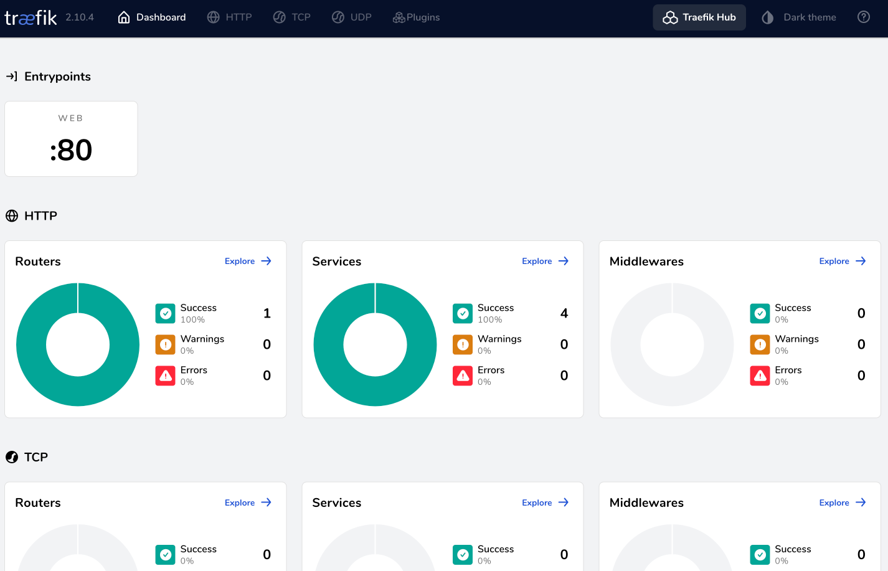

# Setting up Traefik

The first container we'll deploy is Traefik.  First, we'll setup a couple of networks that we'll use for other containers we'll start later.  

## Setup networks

Setup an internal-only network.  This is useful for testing containers for which you want to restrict egress connectivity.

```bash
docker network create --internal internal
```

Next, let's setup a dedicated bridge network for our Reverse Proxy.

```bash
docker network create proxy
```

## Bring up Traefik

Finally, let's hop into the `global` folder that contains all of our services and bring up that compose stack:

```bash
cd ~/icc2023-docker-workshop/global
docker compose up -d
```

## Check the Traefik Dashboard

Once it is running, you should be able to bring up this link in your workspace web browser:

http://proxy.localtest.me


