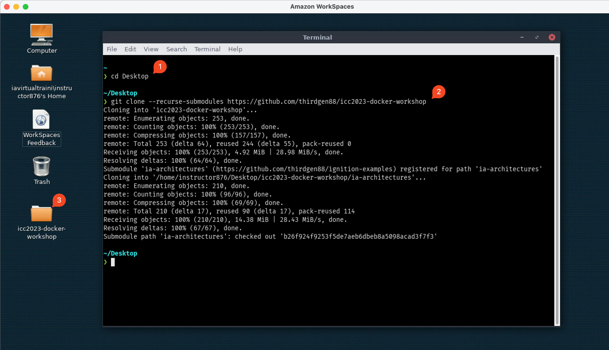

# Clone the Repo

Open a terminal by clicking the icon in the menu bar below.


Then, enter the following commands to change to our `Desktop` folder and clone the repository:

```bash
cd Desktop
git clone https://github.com/thirdgen88/icc2023-docker-workshop
```

You should end up with a folder visible on your desktop.



Finally, open that folder in VSCode:


