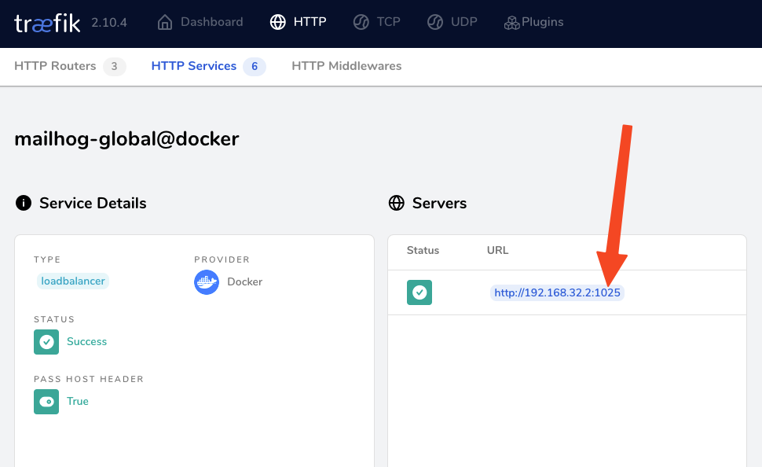
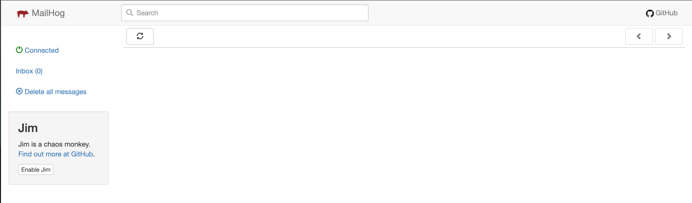

# Launch MailHog

Another service from our global stack that we'll bring up behind our Reverse Proxy is MailHog, a convenient e-mail testing tool.  Run the following from your integrated terminal in VSCode.  It should be running after bringing up the global stack for Traefik in the previous section.  Since Docker Compose is somewhat idempotent, you can always re-run a `docker compose up -d` from the `global` folder to make sure.

## Checking its registration in Traefik

Next, let's check its registration in Traefik by inspecting the dashboard at http://proxy.localtest.me.

## Fixing the Traefik service configuration for Mailhog

Inspecting the service configuration, we see it picked the wrong port (`1025`) to route traffic to.  



The reason for this is that Traefik will attempt to guess the proper port to use based on the set of exposed ports.  Let's take a look at the set of exposed ports by inspecting the `mailhog` container's configuration:

```bash
docker inspect -f '{{ .Config.ExposedPorts }}' mailhog

# highlight-start
# Returns:
#  map[1025/tcp:{} 8025/tcp:{}]
# highlight-end
```

The Web UI for Mailhog listens on port `8025`.  We can explicitly define it through some extra label definitions.  Update the `docker-compose.yml` and then redeploy with another _up_ command.  See the Traefik Docs reference on Docker _label_ configuration for Traefik services [here](https://doc.traefik.io/traefik/routing/providers/docker/#services).

Finally, verify that the service configuration looks correct, and you should then be able to see Mailhog at the following address:

http://mailhog.localtest.me


