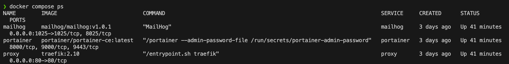
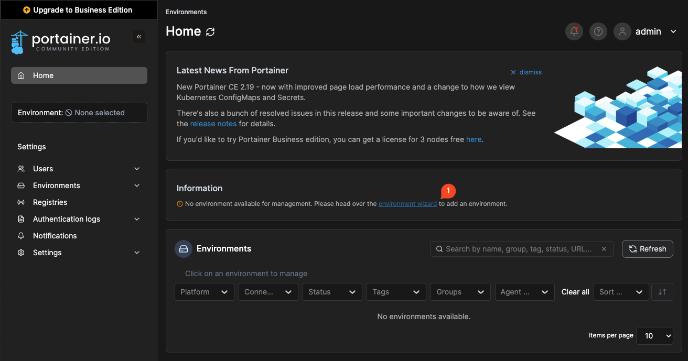
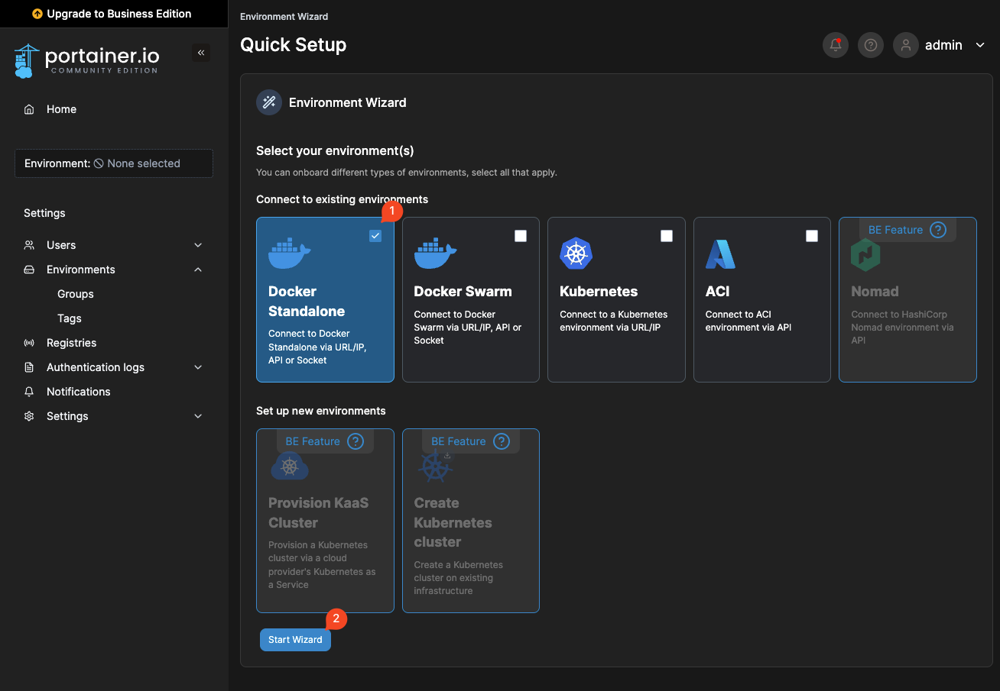
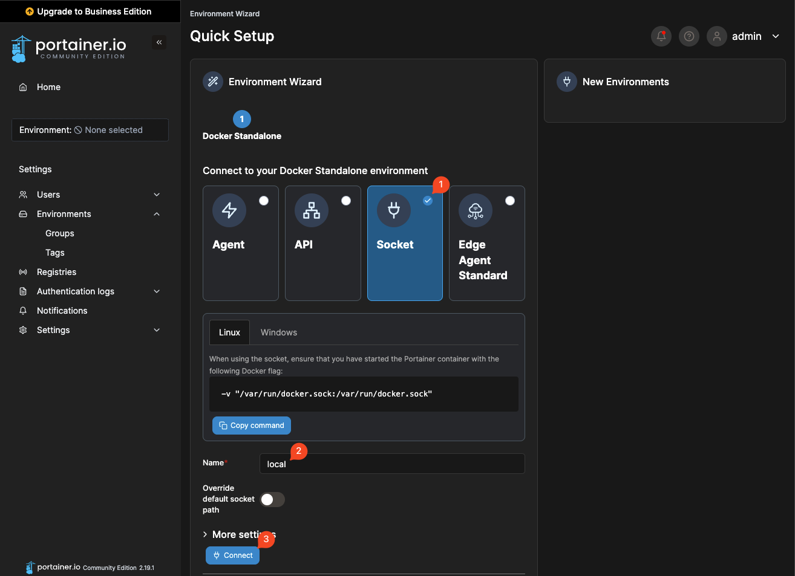
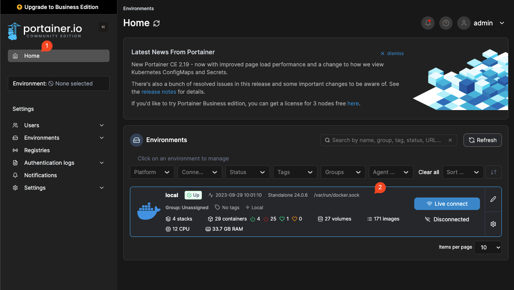
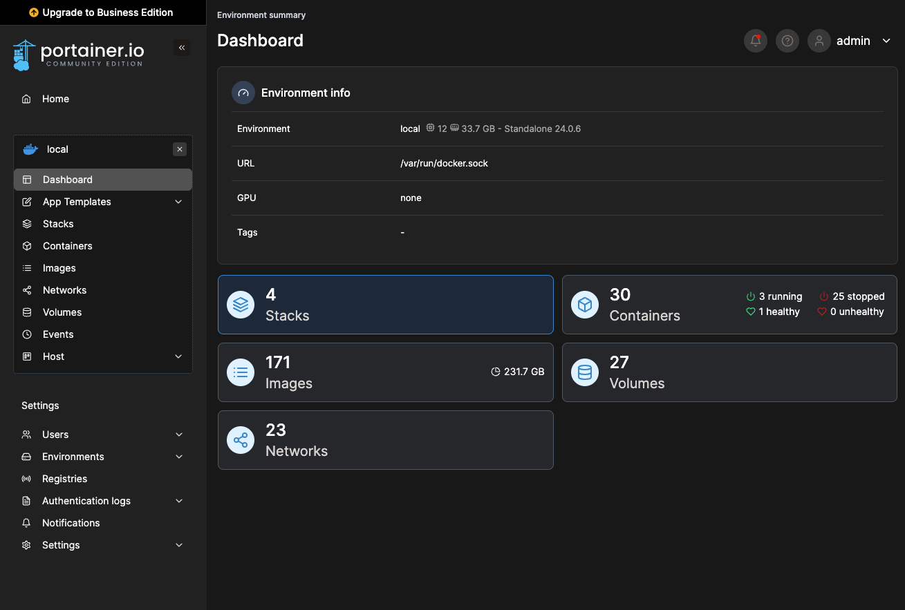

# Bringing up Portainer

With our global stack, we can also see that we've launched Portainer, a web UI for Docker (and more!):

```bash
docker compose ps
```



## Open Portainer Web UI

Bring it up in your web browser at http://portainer.localtest.me:

- Login with username `admin` and password `changeme`
- You can choose to click _Remind me later_ on the change user password prompt.

## Setup Environment

Once you're in, you can move to setup an "environment" to connect to your local Docker Engine. Click the [_environment wizard_](http://portainer.localtest.me/#!/wizard/endpoints) link:



Select the _Docker Standalone_ option and _Start Wizard_:



Finally, select _Socket_ connection method, fill in a name, and click _Connect_:



You should now see your new environment available in the list of environments on the right-hand side of the wizard screen.

## Exploring Portainer

With the environment connected, you should be able to start exploring all of the Compose Stacks, Containers, Volumes, Images, and more!





See the Portainer documentation for more information: https://docs.portainer.io/
