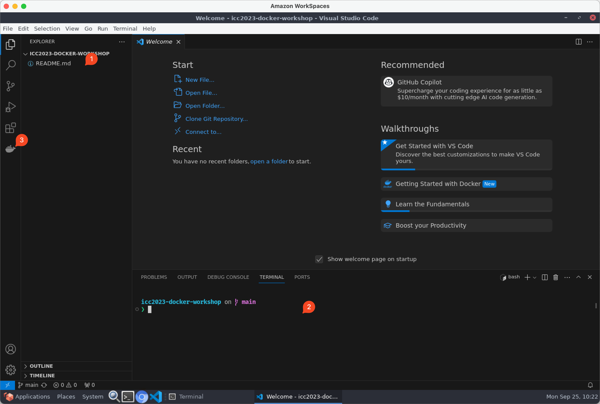

# Visual Studio Code Overview

If you've not used Visual Studio Code before, see the image below and the associated annotations to learn a little more:

1. Explorer is where you can open additional files.
2. Open the integrated terminal with `Ctrl`-`Shift`-\` (backtick, key to left of `1`)
3. The VSCode _Docker Extension_ is pre-installed.  You can visualize current status of running containers and loaded images here.