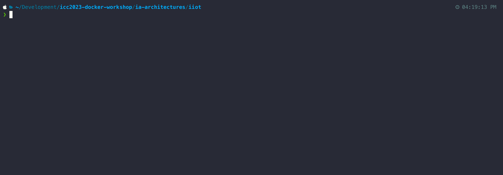
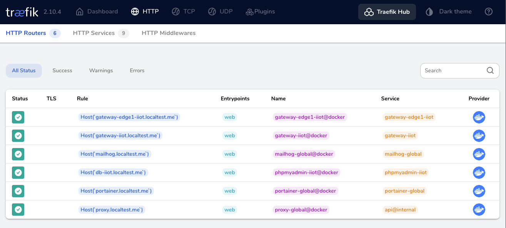

# Launching Ignition IIoT Architecture

After we've made the adjustments to our `ia-architectures/iiot/docker-compose.yml` file (and remembered to save! 😃), we're ready to launch the solution.

## Bringing up the Compose Stack

Run the following to launch the solution:

```bash
docker compose up -d
```



## Checking the Services

Taking a peek at the [Proxy Dashboard](http://proxy.localtest.me/dashboard/#/http/routers) should reveal the following HTTP Routers:



Next, check each of the following URLs:

- http://gateway-iiot.localtest.me
- http://gateway-edge1-iiot.localtest.me
- http://db-iiot.localtest.me (login with MySQL user `root` and password `ignition`)
